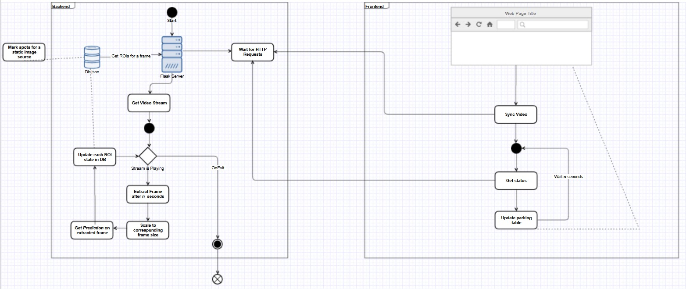

### Idea

Deep Learning approach - Applying Convolutional Neural Networks to classify occupancy of each parking spot.  
Keras model (with TensorFlow backend) was trained on `cnrpark.it` (patches) dataset.  
Predictions are made on images from 8th camera from `cnrpark.it`.

### Algorithms
1. Custom architecture 
2. VGG16 architecture with pretrained weights

### Application
Web application for viewing the occupancy of parking spots from a video with a `flask` server backend.

###### Run instructions
1. Download cnrpark dataset
    - dataset location is CNN-Tensorflow/dataset/free and CNN-Tensorflow/dataset/busy
2. Create venv and install all dependencies
    - virtualenv --system-site-packages -p python ./venv
    - ./venv/Scripts/activate
    - pip install tensorflow
    - pip install opencv-python
    - pip install pillow
    - pip install tinydb
    - pip install flask
    - pip install flask_cors
    - pip install matplotlib
    - pip install pafy
    - pip install youtube_dl
3. Run `Mockup/run.bat` to start the application
4. Open `http://127.0.0.1:5000/` to access the webpage