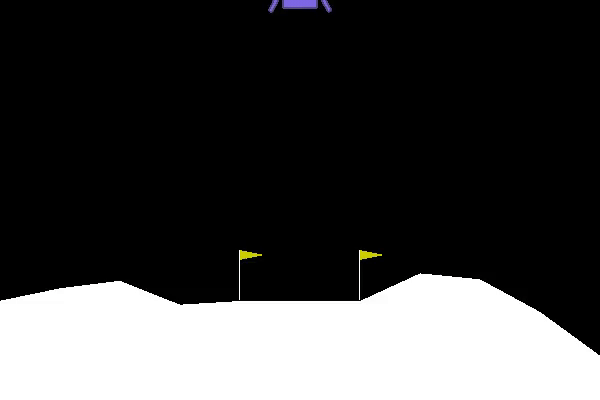

# Deep Q-Learning in Lunar Lander

## Getting started
1. Create virtual environment
```bat
$ virtualenv venv
```
2. Activate virtual environment  
- Windows:
```bat
> venv\Scripts\activate.bat
```
- Linux/MacOS:
```shell
$ source venv/bin/activate
```
3. Install dependencies:
```shell
$ pip install -r requirements.txt
```

## Deep Q-Learning & Results



